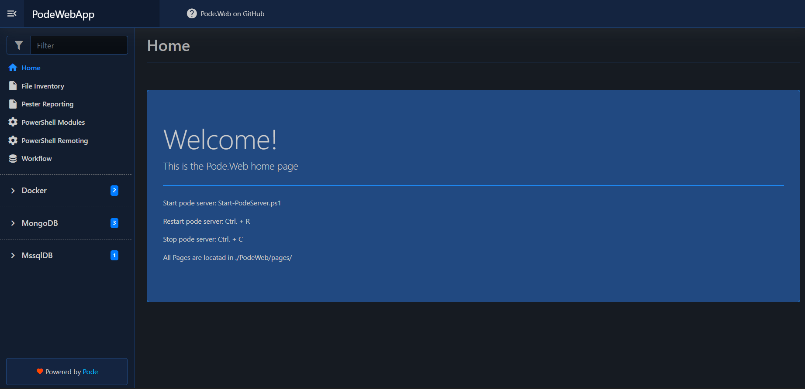
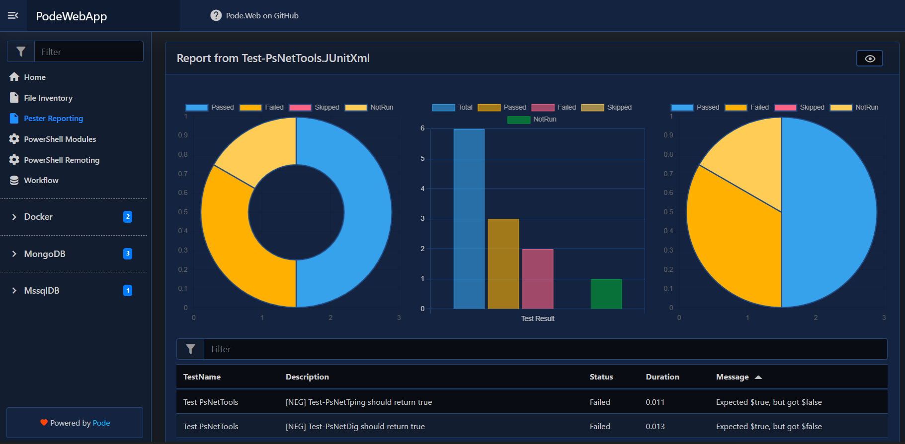

# Table of Contents

- [PSPWApps](#pspwapps)
- [Home page](#home-page)
- [Pester Reports](#pester-reports)
- [Folder structure](#folder-structure)
- [Web Server](#web-server)
- [How to create a JUnitXML](#how-to-create-a-junitxml)
- [How to create a NUnitXML](#how-to-create-a-nunitxml)

# PSPWApps

My PodeWeb framework - a never ending story!

## Home page



[Top](#table-of-contents)

## Pester Reports

Show Pester Reports with charts and tables.



This page display charts and tables for each JUnitXml- or NUnitXml-file in the folder data. To view the code, go to pages and open pester-tests.ps1 and go to bin and open Read-FromXML.psm1.

[Top](#table-of-contents)

## Folder structure

### bin

Path to store the PowerShell-Scripts or Modules.

### data

Path to store the Inputfiles (JUnitXml, NUnitXml).

### pages

Path to store the PodeWeb pages.

[Top](#table-of-contents)

## Web Server

Start-PodeServer.ps1

[Top](#table-of-contents)

## How to create a JUnitXml

Run ````Invoke-Pester -Path .\bin\Invoke-PesterResult.Tests.ps1 -ExcludeTagFilter NotRun -OutputFile .\data\Test-PsNetTools.JUnitXml -OutputFormat JUnitXml````

[Top](#table-of-contents)

## How to create a NUnitXml

Run ````Invoke-Pester -Path .\bin\Invoke-PesterResult.Tests.ps1 -ExcludeTagFilter NotRun -OutputFile .\data\Test-PsNetTools.NUnitXml -OutputFormat NUnitXml````

[Top](#table-of-contents)
